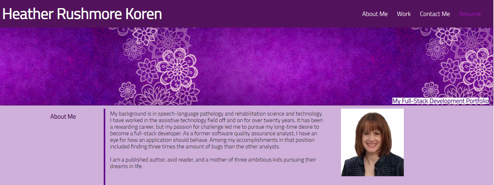

# Koren-Portfolio

* This portfolio was developed to showcase my full-stack development projects.

## Installation

[View my portfolio](https://hrkoren.github.io/Koren-Portfolio/)

## Usage

This portfolio is to be used to explore my various full-stack web development projects.

 

## License

## Tests

The media screen size parameters are built-in to allow the boxes to adjust and rearrange based on the device's screen size.